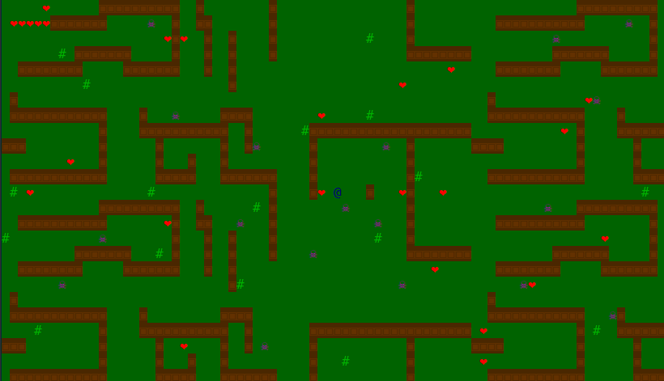

# Nível Avançado

Para o nível avançado você deve exceder as expectativas. As funcionalidades serão mais abertas e você deve escolher quais vai querer implementar.

## Funcionalidade 1: Mapa maior do que a tela

Para esta funcionalidade você deve manter o jogador centralizado e a cada movimento, todo o mapa e os objetos se movem na direção contrária. O mapa não deve caber inteiro na tela de uma vez. Sendo assim, as partes do mapa e os objetos que estiverem fora da região da janela não devem ser desenhados. Abaixo você pode ver um exemplo dessa funcionalidade:



## Funcionalidade 2: Diferentes tipos de inimigos

Adicione outros tipos de inimigos, mais fortes e/ou com mais vidas. É importante que seja possível diferenciar um inimigo do outro.

## Funcionalidade 3: Chefão

O chefão deve ser um inimigo que ocupa mais do que um caractere. Por exemplo:

```
╔═╭─────╮═╗
╔═│╭───╮│═╗
╔═╰│^ ^│╯═╗
   ╰╥═╥╯
    ╰ ╯
```

Ele precisa obrigatoriamente se mover sem se separar (ex: cada parte ir para um lado diferente).

## Funcionalidade 4: Sala secreta

Para esta funcionalidade você deve implementar uma sala que não aparece no mapa enquanto o jogador está andando e só é acessível quando o jogador faz alguma ação específica (por exemplo passar por uma posição específica). A sala secreta deve ser um mapa separado, do qual deve ser possível retornar.

## Funcionalidade 5: Sistema de experiência e níveis

Ao derrotar inimigos o jogador ganha experiência. Ao acumular uma determinada quantidade de experiência, ele sobe de nível. Novos níveis deve trazer algum benefício, como aumento de vida e/ou de força. Essas informações precisam ser visíveis ao jogador.

## Funcionalidade 6: Itens e inventário

Deve ser possível obter itens no mapa ou ao derrotar inimigos. Esses itens devem ser mostrados na tela de inventário, onde será possível utilizar os itens (ex: poção ou aumento na quantidade de vidas temporariamente).

## Funcionalidade 7: Equipamento e limite de mochila

Esta funcionalidade está atrelada à Funcionalidade 6. Deve ser possível adquirir (pode ser no mapa) e trocar equipamentos, que modificam a força ou vidas do jogador.

Além disso, deve ser implementado um limite de itens na mochila. Se o limite for atingido o jogador não poderá pegar o item encontrado.

## Funcionalidade 8: Mapa em arquivo

O mapa deve ser carregado de um arquivo de texto. Algum elemento do mapa (por exemplo, posição dos monstros) deve obrigatoriamente ser aleatório.

## Funcionalidade 9: Monstro cobrinha

Implementar um monstro que se move como uma cobrinha (é apenas um exemplo, você pode implementar de outras formas e tamanhos):

```
o
o ooo
o o ooO.
ooo
```

A cabeça deve se mover e o resto do corpo acompanhar o movimento. Se não for mais possível se mover, invente alguma solução criativa (ex: trocar a cabeça com a cauda e a cobra passa a se mover para a direção oposta).

## Funcionalidade 10: Telas adicionais

Adicione uma tela inicial, uma tela de game over e uma tela de instruções do jogo.

## Funcionalidade 11: Faça a sua sugestão :)

Você pode sugerir outras funcionalidades avançadas. Entretanto, para que ela conte para o total, um professor deve aprovar a sua ideia.

**Importante:** lembre-se de atualizar o [checklist de funcionalidades](funcionalidades-implementadas.md) e de fazer os commits do seu código.
