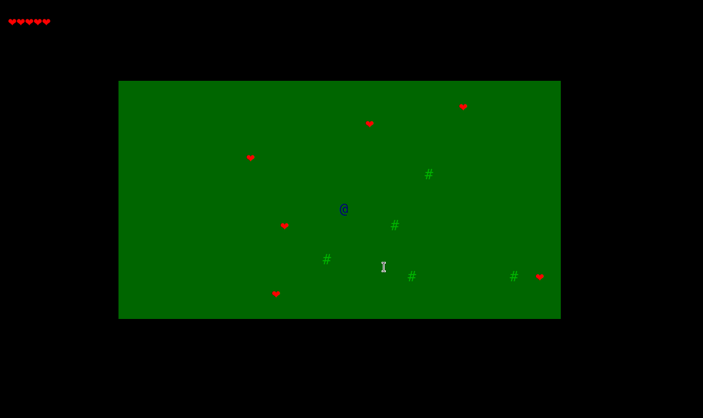

# Nível Básico

Nós já criamos um esqueleto do código para você utilizar como base para o projeto na pasta `codigo`. O arquivo [`jogo.py`](../codigo/jogo.py) é o arquivo principal do seu programa. Ao final desta etapa, seu jogo deve ser mais ou menos assim:

## Etapa 1: Rodando o jogo

Comece executando o jogo para garantir que está tudo configurado corretamente. No Windows, lembre-se de instalar o Windows Terminal e o módulo `windows-curses`, como descrito no [README do projeto](../README.md).

No VS Code, clique com o botão direito na pasta `codigo` e selecione "Copiar caminho" (*"Copy path"*). Agora abra o terminal. Se estiver no Windows, use o Windows Terminal. No Mac, use o atalho COMMAND + ESPAÇO para abrir o Spotlight, digite "Terminal" e selecione o aplicativo de terminal.

No terminal, digite `cd ` e cole o caminho da pasta `codigo` que você copiou anteriormente. O comando completo será parecido com este: `cd C:\Users\toshi\Documents\devlife\devlife-23-1-projeto-individual\codigo` (no Windows) ou `cd /Users/toshi/devlife/devlife-23-1-projeto-individual/codigo` (no Mac). Aperte enter.

Depois digite `python jogo.py` (ou, dependendo da sua configuração: `python3 jogo.py`) e o jogo deverá ser executado.

## Etapa 2: Entendendo o código

Abra o arquivo `jogo.py` no VS Code. Procure entender o que ele faz. Você não precisa entender como cada função funciona nesse primeiro momento, foque na visão do todo: qual é a sequência de passos utilizada?

## Etapa 3: Sorteando posições aleatórias

Implemente a função `gera_posicao_desocupada` no arquivo `incializacao.py` já existe algum código de base e alguns comentários para te ajudar a entender o que deve ser feito.

Depois de implementar esta funcionalidade, [faça um commit](git.md).

## Etapa 4: Inicializando o estado do jogo

Abra a função `inicializa_estado` no arquivo `inicializacao.py`. Leia o código e tente entender o que ele faz. O mais importante é entender para que serve cada valor do dicionário devolvido. Esses valores serão utilizados na função `desenha_tela`. Você pode rodar o debugger ou colocar alguns prints nessa função para tentar entender melhor o que está acontecendo.

Depois de implementar esta etapa, mais uma vez, **é hora de fazer outro commit!**

## Etapa 5: Desenhando na tela

Implemente a função `desenha_tela` do arquivo `tela_jogo.py`. Essa função deve desenhar o mapa, o personagem e todos os objetos que estão no dicionário `estado`. Além disso, a quantidade de vidas deve ser mostrada no topo da janela, assim como a mensagem (no valor `estado['mensagem']`) deve ser mostrada na parte inferior da janela.

Teste o seu jogo. Neste ponto, o mapa e os objetos devem estar desenhados na tela (ainda sem nenhum movimento ou interação com o jogador).

Agora já sabe, faça mais um commit.

## Etapa 6: Atualizando o estado do jogo a cada frame

Implemente a função `atualiza_estado` do arquivo `tela_jogo.py`. Essa função deve utilizar a tecla apertada pelo usuário para mover o jogador pelo mapa. Com as seguintes restrições:

- Se a posição for fora do mapa, o jogador não deve se mover;
- Se a posição estiver ocupada por um coração, o coração deve ser removido da lista de objetos do `estado` e a quantidade de vidas deve ser aumentada em 1 (se ainda não estiver com o máximo de vidas). Além disso, deve ser mostrada uma mensagem indicando o que aconteceu;
- Se a posição estiver ocupada por um espinho a quantidade de vidas deve ser diminuida em 1 (o espinho deve continuar na lista de objetos). Se chegar em 0 vidas, o jogo deve terminar. Além disso, deve ser mostrada uma mensagem indicando o que aconteceu.

A partir de agora não vamos ficar te lembrando sempre, mas lembre-se sempre de fazer commits frequentes. Acredite, essa é uma prática que será muito útil no seu dia a dia.

**Importante:** consulte e atualize o [checklist de funcionalidades](funcionalidades-implementadas.md) para garantir que cumpriu todas as etapas.
