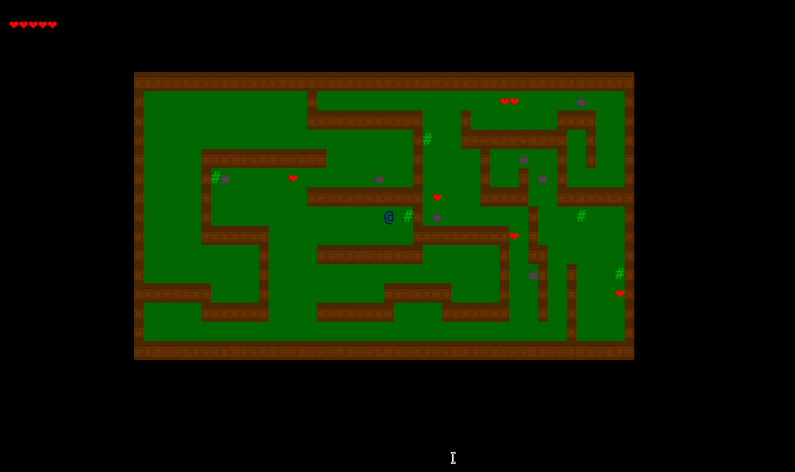

# Enunciado do Projeto Individual

Este projeto individual tem como objetivo desenvolver um jogo roguelike, um subgênero de jogos de RPG com elementos de exploração e sobrevivência. O jogo será desenvolvido utilizando a linguagem Python e um módulo chamado curses, que permite a criação de interfaces de usuário para aplicativos de terminal. O jogador enfrentará monstros, coletará tesouros e tentará sobreviver em um mundo perigoso e desconhecido.

Os principais objetivos de aprendizagem envolvidos neste projeto estão listados abaixo:

- **Aprender a aprender:** 
    - Ler uma documentação resumida e decidir quais funções utilizar para cada situação, incluindo os argumentos necessários;
    - Aprender a utilizar o básico do git, um sistema de controle de versão, para:
        1. Armazenar o código do projeto (criar e clonar repositório);
        2. Salvar novas versões do código (fazer commits).
- **Desenvolver programas de computador:** aplicar os conhecimentos de Python para desenvolver um jogo;
- **Identificar e programar estratégias computacionais de resolução de problemas práticos:** desenvolver algoritmos para implementar as funcionalidades do jogo, a partir de especificações de alto nível.

Abaixo vemos um exemplo do conceito B do projeto:

## O que eu devo fazer?

**Antes de começar o projeto**, vamos aprender a usar o básico do Git. Siga o [guia de Git](git.md) **antes de começar a implementar o projeto**.

O projeto está dividido em 3 partes. Clique nos links para ver mais detalhes de cada parte:

- [**Básico:**](basico.md) inicialização do jogo, desenho da tela no terminal, movimentação do personagem e tratamento de colisões;
- [**Proficiente:**](proficiente.md) paredes e monstros com movimento aleatório, sistema de batalha e mapa carregado a partir de um arquivo;
- [**Avançado:**](avancado.md) adiciona complexidade ao jogo. Nesta parte você deve escolher quais funcionalidades vai implementar a partir de uma lista pré-definida.

**Importante:** Você deve marcar no arquivo [`funcionalidades-implementadas.md`](funcionalidades-implementadas.md) quais funcionalidades implementou no seu código. Nós utilizaremos essa lista para a correção, portanto não se esqueça de atualizá-la.

Para implementar o projeto você deve utilizar as funções fornecidas pelos professores. Elas são responsáveis por chamar o módulo curses, que desenha strings no terminal. Você tem liberdade para modificar e/ou adicionar novas funções conforme achar necessário.

Um dos objetivos deste projeto é começar a se acostumar a fazer consultas a documentações. As funções fornecidas pelos professores estão documentadas [aqui](../codigo/motor_grafico/README.md).

## Rubrica

O projeto será avaliado com base em dois objetivos: funcionalidades implementadas e qualidade de código.

### Funcionalidades implementadas

Os critérios são cumulativos, ou seja, só é possível atingir o conceito B se o conceito C+ for completamente cumprido.

- **[I] Insuficiente:** código tem erros que impedem a execução do jogo;
- **[D] Em Desenvolvimento:** não atingiu o conceito C;
- **[C] Básico:** implementou todas as funcionalidades do [nível básico](basico.md);
- **[C+] Básico:** atingiu o conceito C e implementou algumas funcionalidades do [nível proficiente](proficiente.md);
- **[B] Proficiente:** atingiu o conceito C e implementou todas as funcionalidades do [nível proficiente](proficiente.md);
- **[B+] Proficiente:** atingiu o conceito B e implementou pelo menos 1 funcionalidade do [nível avançado](avancado.md);
- **[A] Avançado:** atingiu o conceito B e implementou pelo menos 3 funcionalidades do [nível avançado](avancado.md);
- **[A+] Avançado:** atingiu o conceito B e implementou pelo menos 6 funcionalidades do [nível avançado](avancado.md).

### Qualidade de código

Neste objetivo avaliaremos se a solução que você propôs está tanto bem escrita em termos de código Python (bem formatado e legível), quanto em termos do método de resolução usado. Este objetivo apenas limita o conceito da lista acima. Veja abaixo as rubricas e o limite que aplicam no conceito acima:

- **Insuficiente (limita ao conceito D):** código tem erros que impedem a execução;
- **Em Desenvolvimento (limita ao conceito C+):** código é ininteligível para seres humanos comuns;
- **Básico (limita ao conceito B+):** 
    - Código possui linhas que não executam ou que não tem nenhum efeito no programa;
    - Variáveis tem nomes que não representam seu significado no programa;
    - O programa usa estruturas de condicionais ou loop de maneira incorreta ou confusa;
    - Funções grandes demais, concentrando muitas responsabilidades;
    - Enviou código comentado.
- **Proficiente (não limita):** Nenhum dos problemas do nível Básico está presente. Ao atingir o nível proficiente, será considerado o conceito de funcionalidades implementadas sem limitação.

### Entregas atrasadas

Commits enviados após o prazo só serão aceitos com a limitação da nota ao conceito C. Ou seja, mesmo se você enviar um commit na madrugada seguinte à entrega, a sua nota máxima será C.
