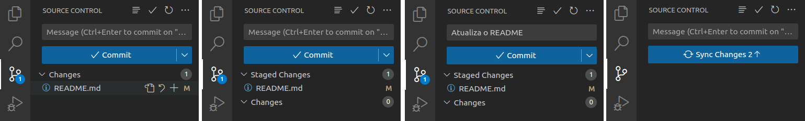

# Introdução ao Git

## Editando um arquivo

Como mencionamos anteriormente, utilizaremos o Git para armazenar as versões do nosso código enquanto trabalhamos no projeto. Com isso será possível observarmos a evolução do seu código e, ao mesmo tempo, você pode sentir mais segurança para fazer mudanças, pois sempre é possível voltar para uma versão anterior do seu código.

As "versões do código" são chamadas de *commits*. Para praticar, vamos começar editando o arquivo `README.md`. Abra o arquivo no VS Code e edite as seguintes partes:

- `[SUBSTITUA PELO TÍTULO DO SEU JOGO]`: substitua pelo título do seu jogo (se não tiver ideias, coloque "Jogo da/do SEU NOME")
- `[ESTE ARQUIVO É APENAS UMA BASE PARA O SEU README. FIQUE À VONTADE PARA MODIFICÁ-LO COMO QUISER - APAGUE ESTA MENSAGEM :)]`: apague esse texto;
- `[SUBSTITUA PELO SEU NOME]`: coloque o seu nome no lugar.

É uma boa prática criar um arquivo `README.md` em todo projeto que fazemos. A ideia é utilizá-lo como uma porta de entrada para seu projeto. Nele escrevemos qual é o objetivo do projeto, como fazemos para executar o programa, o que é necessário instalar (dependências), instruções adicionais, autoria, etc. Desta vez nós fornecemos o arquivo base pronto, mas sinta-se à vontade para modificar o que quiser.

Os arquivos `.md` são arquivos Markdown. Eles são arquivos de texto nos quais podemos utilizar marcações especiais para indicar uma formatação diferente. Para saber mais detalhes, consulte [esta página](https://docs.github.com/en/get-started/writing-on-github/getting-started-with-writing-and-formatting-on-github/basic-writing-and-formatting-syntax).

## Fazendo um commit

Agora que você já editou o arquivo `README.md`, vamos fazer um *commit*, ou seja, vamos salvar a versão atual do nosso projeto.

1. Clique no ícone do controle de versão no menu lateral (agora deve aparecer o número 1 sobre o ícone - isso indica que há 1 arquivo que mudou desde a última versão salva). O arquivo `README.md` deve ser listado como um arquivo que foi modificado ("Changes"). 
2. Mova o mouse sobre o nome do arquivo e clique no botão "+". Ao clicar no botão, o arquivo deve mudar para "Staged Changes". Isso quer dizer que ele entrará no próximo commit.
3. Clique no campo de texto ("Message") e digite uma mensagem (ex: "Atualiza o README"). Todo commit deve ter uma mensagem. Isso nos ajuda a entender o que mudou naquele commit, facilitando o acompanhamento da evolução e também a procurar versões específicas do projeto. 
4. Finalmente, clique no botão "Commit". 

Pronto! O commit está feito!

Antes de clicar no botão "Sync Changes", acesse a página do GitHub novamente. 

Você deve notar que as modificações que você fez ainda não apareceram na página. Isso acontece porque o commit já foi feito, mas você precisa enviar esse novo commit para o servidor do GitHub. Isso é feito clicando no botão "Sync Changes".

Agora sim, clique no botão "Sync Changes" e acesse a página do GitHub novamente. Agora as suas modificações devem aparecer. Parabéns, você fez seu primeiro commit!

Lembre-se de fazer commits frequentemente. Sempre que fizer alguma modificação no código que adicione uma funcionalidade nova, corrija um bug, ou qualquer outra modificação significativa, é uma boa criar um commit.

Agora sim você pode voltar para o [enunciado do projeto](enunciado.md#o-que-eu-devo-fazer).